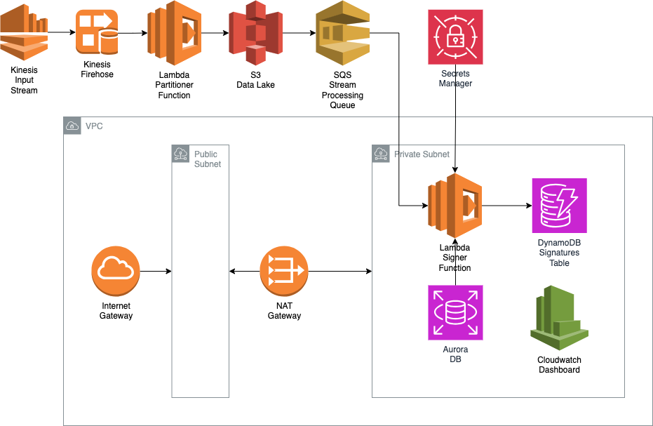

# aws-localstack-stream-processing

Distributed Transaction Signing Pipeline with Kinesis, Aurora, and RSA Lambda

## Problem

Implement a record signing service using a message-driven/microservice architecture with the following requirements:

### Challenge

Given a database of 100,000 records and a collection of 100 private keys, create a process to concurrently sign batches of records, storing the signatures in the database until all records are signed.

### Rules

- No double signing: Only one signature per record should be stored
- Sign each record individually in configurable batch sizes
- Any given key in the keyring must not be used concurrently
- A single key should be used for signing all records in a single batch
- Keys should be selected from least recently used to most recently used
- Batch size should be configurable by the user (does not change during runtime)

### Guidelines
- Use any runtime environment (Golang, TypeScript, etc.)
- Use any orchestration or process coordination tools (message queues, lambdas, etc.)
- Seed the records with random data
- Use a public key crypto algorithm of your choosing

## Solution

### Overview

This project implements a scalable, event-driven architecture for secure transaction signing using AWS LocalStack for local emulation.
It ingests high-throughput unstructured data into Kinesis, persists raw inputs to S3 for replay, and routes records through an intermediate
batching stream that triggers a Lambda function. The Lambda retrieves RSA private key ARNs from Aurora Serverless, signs the batched data,
and stores signed payloads in a separate S3 bucket. It is built with CDK and Docker Compose, the system ensures reliable, exactly-once
processing with optimized Lambda performance and modular RSA key management via AWS Secrets Manager.

### Architecture Diagram



### Getting Started

1. Install required global packages:
```bash
npm install -g aws-cdk aws-cdk-local
```

2. Ensure you have Node.js 20 installed:
```bash
nvm use 20
```

3. Start the development environment:
```bash
docker-compose up -d
```
This will start both Anvil (Ethereum development environment) and LocalStack (AWS services emulator).

4. Install project dependencies:
```bash
# Install dependencies
yarn install
```

5. Deploy the CDK stacks to LocalStack:
```bash
# Configure AWS CLI to use LocalStack
export AWS_ACCESS_KEY_ID=test
export AWS_SECRET_ACCESS_KEY=test
export AWS_REGION=us-east-1

# Bootstrap the environment, if you hvae not done that yet.
yarn bootstrap

# Deploy the stacks
yarn deploy
```

6. Seed the database with RSA key pairs:
```bash
# Generate 60 RSA key pairs
yarn seed:keys 100000
```

The generated keys will be used by the signing service to process transactions.

### Event Driven Architecture

This project uses an event-driven model where each service reacts to events instead of relying on direct calls. 
Firehose receives data pushed into it, stores records in S3, and S3 triggers the next steps via notifications. 
Once an object is created in the S3 bucket, an SQS message is pushed, which starts the signer Lambda. 

### Microservices Orchestration

All components (Firehose, S3, Lambda, Aurora, SQS, and DynamoDB) are loosely connected and communicate via events. 
Data flows through S3 and SQS in a clear path. Firehose handles buffering and partitioning, S3 stores raw files, 
and the signer Lambda signs them using a selected key.

### Infrastructure as Code

We use AWS CDK to define all resources as code in TypeScript. This includes VPC, IAM roles, S3, SQS, Aurora, 
Lambda, and Firehose. You can reproduce the entire infrastructure by running yarn deploy, ensuring consistency 
between environments and simplifying testing and maintenance.

### Concurrency & Race Conditions

The system uses Aurora PostgreSQL with `SKIP LOCKED` to prevent two Lambdas from selecting the same signing key 
at the same time. Locks are applied at the database level during signing, and released after the signature is 
stored. This prevents concurrent signing with the same key. Additionally, DynamoDB uses the hash of each 
transaction to ensure each one is signed only once (idempotency).

### Blockchain Integration & Interoperability

The signer Lambda uses `ethers.js` to create Ethereum-compatible signatures. Transactions are read from S3, 
signed using a private key from Secrets Manager, and the signature is stored in DynamoDB.

### Idempotency

Transaction hashes are calculated using `SHA-256`. This hash acts as the primary key in DynamoDB. If the same 
transaction is seen again, the signature is not duplicated. This guarantees idempotency, meaning transactions 
are signed only once.

### Fault Tolerance & Reliability

SQS acts as a buffer between S3 and the Lambda, so spikes in load won't overload Lambda. Failed Lambda 
executions are retried, and after 3 failures, messages are moved to a Dead Letter Queue (`DLQ`).

### Security & Privacy

Private keys are stored securely in Secrets Manager. Access is granted only to the signer Lambda, restricted 
to the VPC, and IAM roles are scoped with least privilege. Data is encrypted at rest in S3, in transit via 
`HTTPS`, and at the application level in DynamoDB.

### Monitoring & Alerts

A CloudWatch dashboard displays metrics for Lambda, SQS, and DynamoDB. Alarms notify via SNS if Lambda fails, 
the queue grows too large or slow, or DynamoDB throttles requests.

### Testing

LocalStack emulates all AWS services locally. You can run the whole pipeline using Docker Compose. Run 
`yarn seed:keys` to preload the database with records. Use unit tests for Lambdas, and integration tests using 
S3 and SQS mocks. Metrics and logs can be checked in LocalStack's UI or CloudWatch if deployed to AWS.
